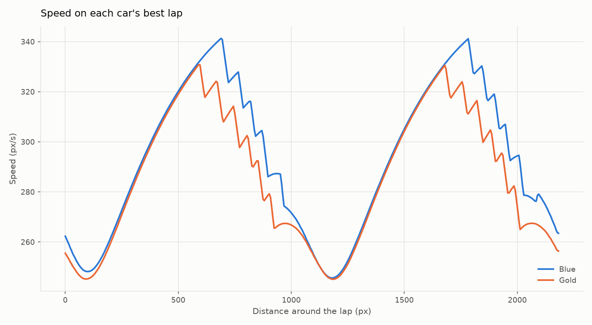
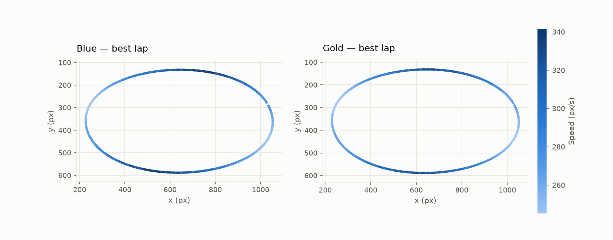

# Racing

A 2D top-down racing game with a physics engine, computer opponents, and a
telemetry system that records every frame of a race and turns it into
analysis plots.

The simulation is kept separate from the rendering, so the same race can be
played in a window or run with no display at all. That is what makes the
analysis work anywhere.

Final project for *Introduction to Python*, TU Dortmund.

## Installation

Requires Python 3.10 or newer.

```bash
git clone https://github.com/rstanly001/racing-game.git
cd racing-game
uv pip install -e .
```

## Usage

```bash
uv run -m racing --help
uv run -m racing race --track oval --laps 3 --opponents 2
uv run -m racing simulate --track figure_eight --laps 3
uv run -m racing analyze
```

| Command | What it does | Needs a display |
| --- | --- | --- |
| `race` | Play against the computer | Yes |
| `simulate` | Race two computer drivers with no window, write telemetry to CSV | No |
| `analyze` | Read that CSV, print summaries, write the figures | No |

`simulate` followed by `analyze` exercises the whole package and produces
every figure without needing a screen.

Two circuits are available, `oval` and `figure_eight`.

### Controls

| Key | Action |
| --- | --- |
| Up | Throttle |
| Down | Brake |
| Left / Right | Steer |
| Esc | Quit |

The panel in the corner shows the lap counter, speed, last and best lap
times, and elapsed race time. The finishing order is printed on exit.

## Generated output

No figure is ever displayed; the Agg backend is selected before pyplot is
imported, and everything is written to disk. These files are committed to
the repository.

| File | Contents |
| --- | --- |
| `output/telemetry.csv` | Per-frame recording: position, speed, inputs, lap |
| `output/speed_trace.png` | Both cars' speed against lap distance, best laps |
| `output/racing_line.png` | The path each car drove, coloured by speed |
| `output/lap_times.png` | Lap time by lap number, one line per car |
| `output/inputs.png` | Throttle, brake and steering over the fastest lap |

Aligning the speed trace by distance rather than by time is what makes the
two cars comparable: the same x value is the same corner for both.





## Using the package as a library

Everything is exported from the top-level package, so a race can be run and
analysed without the game:

```python
from racing import ComputerCar, GameConfig, Race, VehicleSpec
from racing.telemetry import lap_summary
from racing.track import build_oval

track = build_oval()
cars = [
    ComputerCar(VehicleSpec(name="Red"), track, aggression=0.9),
    ComputerCar(VehicleSpec(name="Blue"), track, aggression=0.7),
]

result = Race(track, cars, GameConfig(laps=3)).run()
print(result.winner.name)
print(lap_summary(result.to_frame()).round(2))
```

## Design notes

**Vehicles sit behind an abstract base class.** `Vehicle` extends
`PhysicsBody` and declares one abstract method, `update_controls`.
`PlayerCar` implements it by reading a set of key names — it never imports
pygame, so it can be driven from a test; `ComputerCar` implements it by
following a racing line. The physics engine only ever sees the abstract
interface, so another controller costs one subclass.

**Handling is tuned through `VehicleSpec`, not through the physics code.**
Drag and acceleration together settle the car just under its top speed, so
`max_speed` is a safety net rather than a wall it slams into. Grip is the
fraction of sideways velocity shed per second, raised to the timestep, so it
means the same thing however often the engine steps.

**Laps are counted by checkpoints, in order.** A car is offered every
checkpoint it passes near but accepts only the one it is due to cross next,
so a lap cannot be claimed by reversing over the line or by cutting the
corner a checkpoint sits behind.

**Telemetry accumulates as plain dicts.** Rows are collected in a list and
converted to a DataFrame once at the end; appending to a DataFrame every
frame would cost more than the physics does.

## Project structure

```
src/racing/
├── __init__.py        public API
├── __main__.py        module entry point
├── cli.py             argparse subcommands
├── config.py          tuning constants, VehicleSpec, GameConfig
├── exceptions.py      exception hierarchy
├── physics/           PhysicsBody, PhysicsEngine
├── entities/          Vehicle ABC, PlayerCar, ComputerCar
├── track/             Track geometry, procedural generation
├── game/              Race loop, Renderer
├── telemetry/         per-frame recording, pandas analysis
└── viz/               matplotlib figures
```

## Development

```bash
uv pip install -e ".[dev]"
pytest
ruff check .
ruff format --check .
```

The test suite runs entirely headless and never opens a window.

## License

MIT
